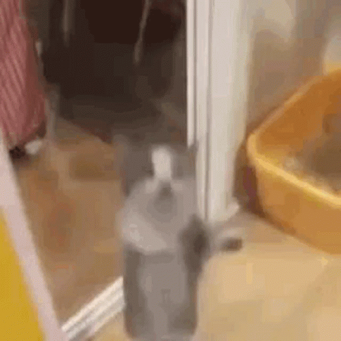

<!DOCTYPE html>
<html lang="en">
<head>
  <meta charset="UTF-8" />
  <meta name="viewport" content="width=device-width, initial-scale=1.0" />
  <title>For You 💜</title>

  <!-- Google Font -->
  <link href="https://fonts.googleapis.com/css2?family=Patrick+Hand&family=Poppins:wght@400;600;700&display=swap" rel="stylesheet">

  
</head>
<body>
  

  <!-- FIRST CARD -->
  

    

    

      Hi, I’m Ybrahim—your new applicant 😌
    

    <button class="btn" id="startBtn">START</button>
    <button class="btn" id="noBtn">AYAW KO</button>
  

  <!-- LETTER PAGE -->
  

    <h1>Why You Deserve Me 💜</h1>

    

      I don’t believe anyone ‘deserves’ someone like they’re a prize,
      but I know what I can offer.
    

    

      I’m loyal and consistent, and when I date, it’s with the intention to marry.
      I don’t play games I show up and put in real effort..
    

    

      I’ve got a sense of humor that can make you laugh, but I know how to be serious when it matters.
      I listen. I understand. I don’t just react.
    

    

      I’m still growing—with goals, discipline, and purpose. I don’t give up easily, especially on someone I care about.
    

    

      I can be your peace when things get heavy, the kind of support you didn’t even know you needed and still keep things fun and exciting.
    

    

      And honestly, I’m this sure because I know what I bring to the table—but I also appreciate how easy it is to be myself when I’m talking to you.
    

    

      I’m not perfect — but I can be someone worth choosing.
    

    

      — Ybrahim
    

  

  

</body>
</html>
